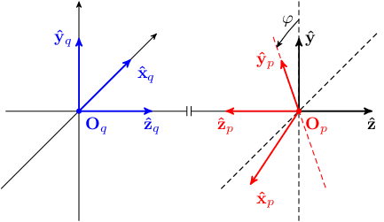

# Example of reproducible TeX/TikZ figure using Nix

TikZ reproduction of the linked [sketch](./img/sketch.jpg).

The result looks like



## Environment setup using Nix
Use [Nix][nix] to set up a reproducible environment for editing this
figure. Note that the first time these commands are run, there may be
a significant delay if the dependencies (e.g. TeXLive) need to be
downloaded and built.

### Building from scratch
``` shell
nix-build
```
The output PDF is created in `./result`.

### Editing
``` shell
nix-shell
```
This drops you into a shell environment with the necessary dependencies.
E.g. you can then run
``` shell
pdflatex figure.tex
```
to rebuild the figure after editing the TeX code.

[nix]: https://nixos.org/nix/
